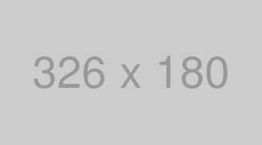

CatNose 氏 [(@catnose99)](https://twitter.com/catnose99) のやり方を真似て、マークダウンでの表現一覧をここにまとめる。

## 見出し

```Markdown
## Heading2

### Heading3

#### Heading4

##### Heading5
```

## Heading2

### Heading3

#### Heading4

##### Heading5

---

## リスト

### 中黒リスト

```Markdown
- Sample text
- Sample text
- Sample text
  - Sample text
  - Sample text
```

- Sample text
- Sample text
- Sample text
  - Sample text
  - Sample text

### 数字リスト

```Markdown
1. Sample text
1. Sample text
1. Sample text
  1. Sample text
  1. Sample text
```

1. Sample text
1. Sample text
1. Sample text
1. Sample text
1. Sample text

---

## テキスト装飾

```Markdown
_イタリック_
**太字**
~~打ち消し線~~
インラインで`code`を挿入する
こちらは[僕の Twitter のリンク](https://twitter.com/catnose99)
```

_イタリック_  
**太字**  
~~打ち消し線~~  
インラインで`code`を挿入する  
こちらは[僕の Twitter のリンク](https://twitter.com/catnose99)

---

## 引用

> 引用文
>
> > ネストされた引用文

---

## テーブル

```Markdown
| Head | Head | Head |
| ---- | ---- | ---- |
| Text | Text | Text |
| Text | Text | Text |
```

| Head | Head | Head |
| ---- | ---- | ---- |
| Text | Text | Text |
| Text | Text | Text |

---

## コード

````Markdown
```css
body {
  color: red;
}
```
````

```css
body {
  color: red;
}
```

---

## 画像

```Markdown

```


---

## 埋め込み

```Markdown
`youtube:https://www.youtube.com/embed/19R93fiKyRA`
```

`youtube:https://www.youtube.com/embed/19R93fiKyRA`

<blockquote class="twitter-tweet" data-lang="ja">
  <p lang="ja" dir="ltr">だれでも簡単に美しいWebポートフォリオを作成できるサービス RESUME（レジュメ）をリリースしました🎉<br><br>イラストレーター、カメラマン、デザイナー、エンジニアだけでなく、研究者、マーケターなどなど誰でも使えるサービスです！<br>ポートフォリオを作りたい人に届け〜<a href="https://t.co/DtTLqSqs7I">https://t.co/DtTLqSqs7I</a> <a href="https://t.co/Oq7ib0Um3k">pic.twitter.com/Oq7ib0Um3k</a></p>&mdash; CatNose😺 (@catnose99) <a href="https://twitter.com/catnose99/status/1090554889816555520?ref_src=twsrc%5Etfw">2019年1月30日</a>
</blockquote>

---

こうしてまとめてみると何が必要で何が足りていないかがわかる。
