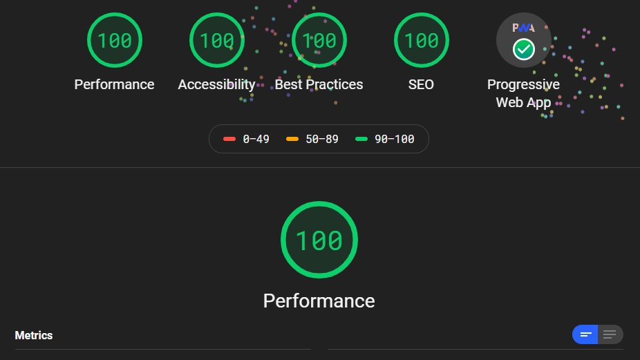

実際に作って公開した感想を交えて紹介。

## メリット

### 爆速

あまり手を加えなくても爆速の Web サイトが作れる。
実際に、スピード計測 PageSpeed Insights では 98~100 点のハイスコアを叩き出す。
(ちなみにこの Web サイトを Lighthouse で計測したところ花火が打ち上がりました。)

### 画像の処理

わりと億劫な画像の処理を Gatsby なら自動でやってくれる

- １つの画像で複数サイズの画像を生成
- 画面サイズによって最適なサイズの画像を読み込む
- 遅延読み込み

### マークダウンで記事がかける

ローカルで記事ごとにマークダウン形式のファイルをつくるそこでかける。
つまりオフラインでも記事がかける。
notion でまとめた情報を、見出しなどの情報をもったままコピペできる。

### 単体で動く

Wordpress みたいにサーバーにデータベースとか用意する必要がないため firebase にそのままおける。
ちなみにこの Web サイトの使用状況は 1GB 中たったの 5MB。
公開して知り合いや就活などで見せる程度なら無料プランで問題ない。
またドメインにこだわりがなければ firebase が用意してくれるのでドメイン代も必要なし。（もちろん後に自身のドメインに変更することが可能。）

## デメリット

### 学習コスト

ほんとに難しい。
英語と React の両方の力が必要だと製作中に感じた。
ただ、勉強にはとてもなる。

### ポートをちょくちょくかえないといけない

製作中にちょくちょく謎のエラーがでて、ポートを変更をするとそのエラーはなおる。
（別のスターターをいれた初期の状態でもそのポートだとエラーでつかえなくなる。）
対処法知ってる方、これかな？ってぐらいの気持ちでも大丈夫なので教えて下さい。
[制作した Web サイトの GitHub のリンク](https://github.com/IsaacTakuma/webstein)

## まとめ

わりと周りではよくきくと耳にする Gatsby。
数年後、「blog をつくるなら」の中に Gatsby が選択肢にきてもいいんじゃないかなと。
お手軽に（？）自分のサイトを公開できるのでよかったら挑戦してください。

そしてお手軽に公開できるよう、頑張って記事書きます。
