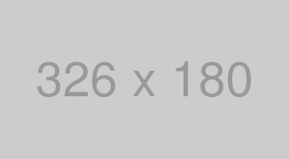

メモアプリなどで何かと使われるマークダウン記法。  
ある程度必要な書き方はまとめているので、マークダウン記法を憶えたい人も是非参考にしてほしい。
こうしてまとめてみると何が必要で何が足りていないかがわかる。  
今回は、CatNose 氏 [@catnose99](https://twitter.com/catnose99) のやり方を参考にしている。

---

## 目次

> - 見出し
> - リスト
> - テキスト装飾
> - 引用
> - テーブル
> - コード
> - 画像
> - 埋め込み

## 見出し

```md
## Heading2

### Heading3

#### Heading4
```

## Heading2

### Heading3

#### Heading4

---

## リスト

### 中黒リスト

```md
- 中黒リスト
- 中黒リスト
- 中黒リスト
  - 中黒リスト
  - 中黒リスト
```

- 中黒リスト
- 中黒リスト
- 中黒リスト
  - 中黒リスト
  - 中黒リスト

### 数字リスト

```md
1. 数字リスト
1. 数字リスト
1. 数字リスト
1. 数字リスト
1. 数字リスト
```

1. 数字リスト
1. 数字リスト
1. 数字リスト
1. 数字リスト
1. 数字リスト

---

## テキスト装飾

```md
_イタリック_
**太字**
~~打ち消し線~~
インラインで`code`を挿入する
これは[Google 先生のリンク](https://google.com)
```

_イタリック_  
**太字**  
~~打ち消し線~~  
インラインで`code`を挿入する  
これは[Google 先生のリンク](https://google.com)

---

## 引用

```md
> 引用文
>
> > ネストされた引用文
```

> 引用文
>
> > ネストされた引用文

---

## テーブル

```md
| Head | Head | Head |
| ---- | ---- | ---- |
| Text | Text | Text |
| Text | Text | Text |
```

| Head | Head | Head |
| ---- | ---- | ---- |
| Text | Text | Text |
| Text | Text | Text |

---

## コード

````md
```css
body {
  color: red;
}
```
````

```css
body {
  color: red;
}
```

---

## 画像

```md

```


---

## 埋め込み

### youtube

```md
`youtube:https://www.youtube.com/embed/lepYkDZ62OY`
```

`youtube:https://www.youtube.com/embed/lepYkDZ62OY`

### twitter

<blockquote class="twitter-tweet" data-lang="ja" data-theme="light"><p lang="ja" dir="ltr">皆さんが不安に思うことなくTwitterで情報を見たり共有したりできることが望ましいと考えています。しかし、タイムライン上の動画や写真の中には何が本物かどうかの判断が難しいことがあります。そうした誤った情報に対抗するべく、新しいルールを定め、それに伴うプロダクトアップデートを行います。 <a href="https://t.co/61DgU7nyXA">pic.twitter.com/61DgU7nyXA</a></p>&mdash; Twitter Japan (@TwitterJP) <a href="https://twitter.com/TwitterJP/status/1224802584650584064?ref_src=twsrc%5Etfw">2020年2月4日</a></blockquote>
